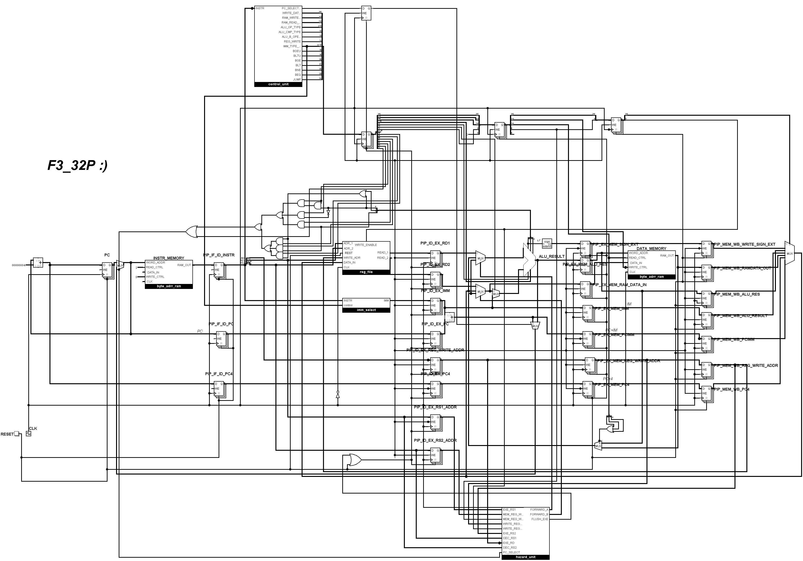

# 5-Stage Pipelined RISC-V CPU + Custom Made FS Language


* A **5-stage pipelined RISC-V CPU** implemented in SystemVerilog
* A custom **assembler** for RISC-V machine code generation
* A **C-like high-level language (FS) compiler** that lowers into RISC-V assembly

It’s designed for educational purposes and to explore **compiler + CPU co-design**.

---

## Features

* **CPU**: Classic 5 pipeline stages (**IF, ID, EX, MEM, WB**) with forwarding and branch handling
* **Assembler**: Simple RISC-V assembler with optional IR output
* **Compiler (FS)**: A C-like language with functions, loops, pointers, arrays, and custom syntax
* **Examples**: Programs for both assembler and FS are provided in `docs/compiler/examples/` and `docs/assembler/examples/`

---

## Repository Structure

```

├── assets/             \# Diagrams and figures
├── assembler/          \# Source code for assembler
├── compiler/           \# Source code for FS compiler
│   ├── compiler/       \# Compiler source code (FS -\> Assembly)
│   └── assembler/      \# Assembler source code (Assembly -\> Machine Code)
├── cpu/                \# CPU design files (SystemVerilog, diagrams)
├── docs/               \# Documentation
│   ├── cpu/            \# CPU documentation (pipeline, hazards, registers, etc.)
│   ├── compiler/       \# Compiler documentation + examples
│   ├── assembler/      \# Assembler documentation + examples
└── README.md           \# This file

```

---

### Building

### Requirements

* `g++` (C++14 or newer)

### Build Compiler + Assembler

Detailed instructions for building the compiler and assembler are available in the documentation:

* **[Building the Compiler (FS)](docs/compiler/compiler.md)**
* **[Building the Assembler](docs/assembler/assembler.md)**
-----

## Usage

### Assembler

Output Machine Code:

```bash
./assembler program.s program.bin
```

Examples: `docs/assembler/examples/`

### Compiler (FS)

Compile an FS program (`program.fs`) into RISC-V assembly:

```bash
./fsrvc program.fs --emit-asm program.s
```

Examples: `docs/compiler/examples/`

-----


## Documentation

Detailed documentation can be found in the `docs/` folder:

  * **CPU Overview**
      * Pipeline
      * Registers
      * Instructions
      * Hazards
      * Simulation
  * **[Compiler Documentation](docs/compiler/)**
  * **[Assembler Documentation](docs/assembler/)**
  * **[CPU Simulation Guide](docs/cpu/simulation.md)**

-----

## Notes & Limitations

This project is primarily **educational** and demonstrates the interaction between a CPU and its compiler. While fully functional, there are some limitations:

- **Minimal error handling:** Syntax or type errors may not always produce clear messages.  
- **Unoptimized machine code:** The compiler prioritizes correctness and debuggability over performance.  
- **Assembler limitations:** Only a subset of RISC-V is supported; some directives (e.g., `.globl`, `.text`) are omitted.  
- **Simplified memory model:** Assumes ideal conditions with 0-cycle memory access.  

> **Note:** The included examples—Min/Max of an array, Factorial calculation, and Insertion Sort—work correctly. However, the compiler is still a work in progress, and hidden bugs may exist. **The CPU executes the generated machine code flawlessly; there are no CPU bugs.** Use this project for learning and experimentation! 💖

---
## References

This work is based on concepts from:

  * *Digital Design and Computer Architecture: RISC-V Edition* by Sarah L. Harris and David Money Harris
